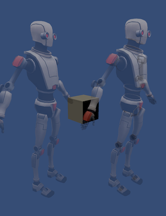

# URP 를 이용한 Shader Example

## 완료 기능

- Rim Light
- Outline
- Cel Shading
- Outline using Sobel Filter (referenced by UniversalRenderExample Github)

  - 소벨 필터로 외곽선 검출 후 RenderFeature 를 통한 포스트 프로세싱 방식

- Alpha Blending

> RenderFeature 를 이용해서, 알파 블렌딩 시 가려지는 부분이 보이는 문제 해결

